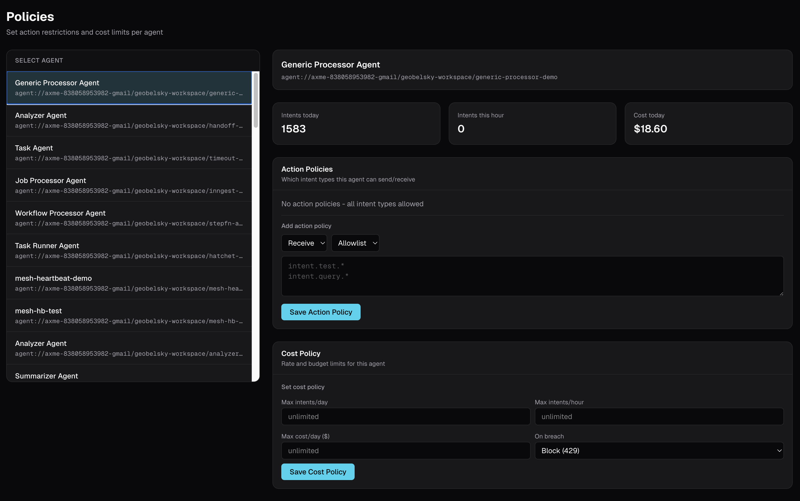

# AXME

**Durable execution for AI agents and services.**

Submit work once. The platform drives it to completion through crashes, retries, timeouts, and human approval steps.

[](https://cloud.axme.ai/alpha/cli) [](LICENSE) [](https://cloud.axme.ai)

**[Quick Start](#quick-start)** · **[Docs](https://github.com/AxmeAI/axme-docs)** · **[Examples](https://github.com/AxmeAI/axme-examples)** · **[Spec](https://github.com/AxmeAI/axme-spec)**

---

```python
intent = client.send_intent({
    "intent_type": "intent.deployment.approval.v1",
    "to_agent": "agent://myorg/prod/deploy-checker",
    "payload": {"service": "api-gateway", "version": "3.2.1"},
})
result = client.wait_for(intent["id"])  # waits hours if needed. survives crashes.
```


---

## The Problem

- AI agents block forever waiting for human approval - no reminders, no escalation, session dies
- Agent crashes mid-task - state is gone, start over from scratch
- Webhook retry is everyone's problem - backoff, jitter, DLQ, HMAC, idempotency
- Multi-agent coordination across machines - most frameworks only work in one process
- Temporal is overkill for 80% of use cases - cluster, determinism constraints, no built-in HITL
- Agents in production with zero visibility - no health checks, no cost tracking, no way to stop a misbehaving agent

## Before and After

**Without AXME** - polling, webhooks, Redis, and glue code:

```python
resp = requests.post("https://api.vendor.com/generate", json=payload)
job_id = resp.json()["job_id"]

for _ in range(120):                          # poll loop
    status = requests.get(f".../jobs/{job_id}").json()
    if status["state"] in ("completed", "failed"):
        break
    time.sleep(5)

@app.post("/webhooks/vendor")                 # webhook endpoint
def handle_webhook(req):
    redis.set(f"job:{req.json['job_id']}", req.json["result"])

result = redis.get(f"job:{job_id}")           # fetch from cache
```

**With AXME** - submit once, get result later:

```python
from axme import AxmeClient, AxmeClientConfig

client = AxmeClient(AxmeClientConfig(api_key="axme_sa_..."))
intent = client.send_intent("agent://myorg/prod/generator", payload)
result = client.wait_for(intent["id"])        # retries, timeouts, delivery - handled
```

No polling. No webhooks. No Redis. No glue code.

---

## Quick Start

```bash
# Install CLI
curl -fsSL https://raw.githubusercontent.com/AxmeAI/axme-cli/main/install.sh | sh

# Authenticate
axme login

# Run your first example
axme examples run human/cli
```

Full walkthrough: [cloud.axme.ai/alpha/cli](https://cloud.axme.ai/alpha/cli)

---

## Agent Mesh - See and Control Your Agents

Every agent you deploy gets real-time monitoring, policy enforcement, and a kill switch.


**Dashboard** - all agents on one screen with health, intents, and cost tracking (day/week/month).

**Policies** - restrict which intent types an agent can send or receive, set cost and rate limits, auto-block on breach.



**Kill switch** - isolate a misbehaving agent in one click. All intents blocked instantly. Reversible.

```python
from axme import AxmeClient, AxmeClientConfig

client = AxmeClient(AxmeClientConfig(api_key="axme_sa_..."))
client.mesh.start_heartbeat()  # agent appears in dashboard with live health
client.mesh.report_metric(success=True, latency_ms=230, cost_usd=0.02)
```

---

## How AXME Compares

| | DIY (webhooks + polling) | Temporal | AXME |
|---|---|---|---|
| Polling | Yes | No | No |
| Webhooks | Yes | No | No |
| Human approvals | Custom build | Possible (heavy) | Built-in (8 task types) |
| Workflow code | Manual state machine | Required (deterministic) | Not required |
| Agent monitoring | Custom build | No | Built-in dashboard |
| Cost controls | No | No | Per-agent policies + kill switch |
| Setup | Low (but fragile) | High (cluster + workers) | None (managed) |
| Lines of code | ~200 | ~80 | 4 |

---

## What You Can Build

**Backend teams** - approval flows, long-running API orchestration, replace polling and webhooks.

**AI agent builders** - human-in-the-loop that waits hours not minutes, multi-agent pipelines with handoffs, production durability across restarts, framework-agnostic (LangGraph, CrewAI, AutoGen, raw Python).

**Platform teams** - one coordination protocol instead of webhook-polling-queue stack, simpler than Temporal.

---

<details>
<summary><strong>Intent Lifecycle</strong></summary>

```
CREATED -> SUBMITTED -> DELIVERED -> ACKNOWLEDGED -> IN_PROGRESS -> WAITING -> COMPLETED
                                                                            \-> FAILED
                                                                            \-> CANCELLED
                                                                            \-> TIMED_OUT
```

</details>

<details>
<summary><strong>Delivery Bindings</strong></summary>

How intents reach agents and services:

| Binding | Transport | Use Case |
|---|---|---|
| `stream` | SSE (server-sent events) | Real-time agent listeners |
| `poll` | GET polling | Serverless / cron-based consumers |
| `http` | Webhook POST | Backend services with an HTTP endpoint |
| `inbox` | Human inbox | Human-in-the-loop tasks |
| `internal` | Platform-internal | Built-in platform steps (reminders, escalations) |

</details>

<details>
<summary><strong>Human Task Types</strong></summary>

| Type | Purpose |
|---|---|
| `approval` | Binary yes/no decision gate |
| `review` | Content review with comments and verdict |
| `form` | Structured data collection |
| `manual_action` | Physical or out-of-band action |
| `override` | Manual override of an automated decision |
| `confirmation` | Acknowledge receipt before proceeding |
| `assignment` | Route work to a specific person or team |
| `clarification` | Request missing information |

Three paths for human participation:

| Path | How |
|---|---|
| **CLI** | `axme tasks list` then `axme tasks approve <task_id>` |
| **Email** | Magic link sent to assignee; click to approve/reject |
| **Form** | Custom form submitted via API or embedded UI |

</details>

<details>
<summary><strong>Connecting an Agent</strong></summary>

```python
from axme import AxmeClient, AxmeClientConfig

client = AxmeClient(AxmeClientConfig(api_key="axme_sa_..."))

for delivery in client.listen("agent://myorg/myworkspace/my-agent"):
    intent = client.get_intent(delivery["intent_id"])
    result = process(intent["payload"])
    client.resume_intent(delivery["intent_id"], result)
```

Agent addressing: `agent://org/workspace/name`

</details>

<details>
<summary><strong>ScenarioBundle</strong></summary>

A JSON file that declares agents, human roles, workflow steps, and an intent - everything to run a coordination scenario:

```json
{
  "scenario_id": "human.cli.v1",
  "agents": [
    { "role": "checker", "address": "deploy-readiness-checker", "delivery_mode": "stream", "create_if_missing": true }
  ],
  "humans": [
    { "role": "operator", "display_name": "Operations Team" }
  ],
  "workflow": {
    "steps": [
      { "step_id": "readiness_check", "assigned_to": "checker" },
      { "step_id": "ops_approval", "assigned_to": "operator", "requires_approval": true }
    ]
  },
  "intent": {
    "type": "intent.deployment.approval.v1",
    "payload": { "service": "api-gateway", "version": "3.2.1" }
  }
}
```

```bash
axme scenarios apply scenario.json --watch
```

</details>

<details>
<summary><strong>MCP - AI Assistant Integration</strong></summary>

AXME exposes an MCP server at `mcp.cloud.axme.ai`. AI assistants (Claude, ChatGPT, Gemini) can manage the platform through 48 tools.

```
POST https://mcp.cloud.axme.ai/mcp
Authorization: Bearer <account_session_token>

{"jsonrpc": "2.0", "id": 1, "method": "tools/call",
 "params": {"name": "axme.intents_send", "arguments": {
   "to_agent": "agent://myorg/production/my-agent",
   "intent_type": "task.process.v1",
   "payload": {"data": "..."}
 }}}
```

[Connector setup guides](https://github.com/AxmeAI/axme-docs/tree/main/docs/connectors) for Claude, ChatGPT, and Gemini.

</details>

<details>
<summary><strong>AXP - the Intent Protocol</strong></summary>

AXP is the open protocol behind AXME. It defines the intent envelope, lifecycle states, delivery semantics, and contract model. AXP can be implemented independently of AXME Cloud.

Protocol spec: [axme-spec](https://github.com/AxmeAI/axme-spec)

</details>

<details>
<summary><strong>SDKs</strong></summary>

All SDKs implement the same AXP protocol surface. All are at **v0.1.2 (Alpha)**.

| SDK | Package | Install |
|---|---|---|
| **[Python](https://github.com/AxmeAI/axme-sdk-python)** | `axme` | `pip install axme` |
| **[TypeScript](https://github.com/AxmeAI/axme-sdk-typescript)** | `@axme/axme` | `npm install @axme/axme` |
| **[Go](https://github.com/AxmeAI/axme-sdk-go)** | `github.com/AxmeAI/axme-sdk-go/axme` | `go get github.com/AxmeAI/axme-sdk-go@latest` |
| **[Java](https://github.com/AxmeAI/axme-sdk-java)** | `ai.axme:axme-sdk` | Maven Central |
| **[.NET](https://github.com/AxmeAI/axme-sdk-dotnet)** | `Axme.Sdk` | `dotnet add package Axme.Sdk` |

</details>

<details>
<summary><strong>Repository Map</strong></summary>

| Repository | Description |
|---|---|
| **[axme](https://github.com/AxmeAI/axme)** | This repo - project overview and entry point |
| **[axme-docs](https://github.com/AxmeAI/axme-docs)** | API reference, integration guides, MCP connector setup |
| **[axme-examples](https://github.com/AxmeAI/axme-examples)** | Runnable examples across all SDKs |
| **[axme-cli](https://github.com/AxmeAI/axme-cli)** | CLI - manage intents, agents, scenarios, tasks |
| **[axme-spec](https://github.com/AxmeAI/axme-spec)** | AXP protocol specification |
| **[axme-conformance](https://github.com/AxmeAI/axme-conformance)** | Conformance test suite |

</details>

<details>
<summary><strong>Contributing</strong></summary>

- **Protocol / schemas** - [axme-spec](https://github.com/AxmeAI/axme-spec)
- **Documentation** - [axme-docs](https://github.com/AxmeAI/axme-docs)
- **SDK improvements** - respective SDK repository
- **Examples** - [axme-examples](https://github.com/AxmeAI/axme-examples)
- **Conformance checks** - [axme-conformance](https://github.com/AxmeAI/axme-conformance)

See [CONTRIBUTING.md](CONTRIBUTING.md) · [SECURITY.md](SECURITY.md) · [CODE_OF_CONDUCT.md](CODE_OF_CONDUCT.md)

</details>

---

[hello@axme.ai](mailto:hello@axme.ai) · [@axme_ai](https://x.com/axme_ai) · [Security](SECURITY.md) · [License](LICENSE)
